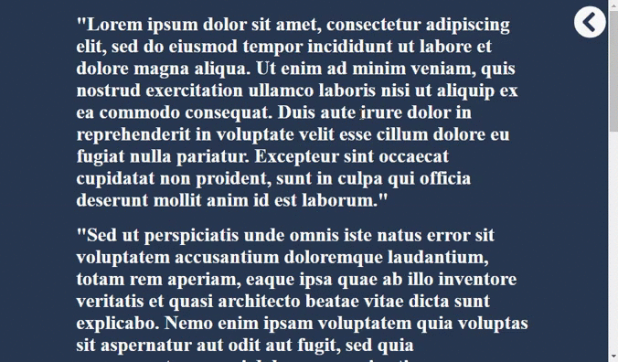

# Pure-CSS-Sidenav
> This project is created to demonstrate the JavaScript-free sidenav example by using pure-CSS with CSS animations. Check this [article](https://medium.com/@safaerden/a-simple-recipe-to-create-animated-sidenav-without-javascript-539219337ea5) for detailed indformation.

## Gif Shot

## Built With

- HTML,
- CSS

## Live Demo

[Live Demo Link](https://safaerden.github.io/Pure-CSS-Sidenav/)

### Prerequisites

-Any kind of browser supporting CSS3 and HTML5

### Setup

-Fork the repo to your remote repository.
-Clone or download the repository to your local machine.

### Install

-No installation needed.

### Usage

-Visit the live demo link on your web browser.

## Author

👤 **Safa ERDEN**

- Github: [@SafaErden](https://github.com/SafaErden)
- Twitter: [@safaerden](https://twitter.com/safaerden)
- Linkedin: [SafaErden](https://www.linkedin.com/in/safaerden/)
- Mql5: [safaerden](https://www.mql5.com/en/users/safaerden)
- Email: [safaerden](mailto:safaerden@gmail.com)

## 🤝 Contributing

Contributions, issues and feature requests are welcome!

Feel free to check the [issues page](https://safaerden.github.io/Microverse-Summit/)

## Show your support

Give a ⭐️ if you like this project!

